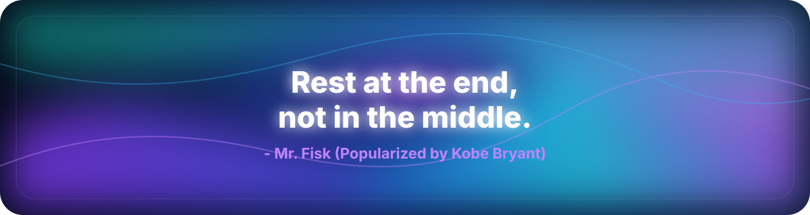

# Asad Akbar

Building **Clevoir**, an AI platform that helps non-technical users create, publish, monetize, and rapidly iterate on multiplayer 2D and 3D games.

I share open-source projects, experiments, and the things I learn while building.

 

  
  
  
  

---

## Focus

AI creative tools, multiplayer game systems, fast publishing workflows, and open-source products.

## Stack

## Contact

Email is the best way to reach me: [Asad.akbar@mail.utoronto.ca](mailto:Asad.akbar@mail.utoronto.ca)
